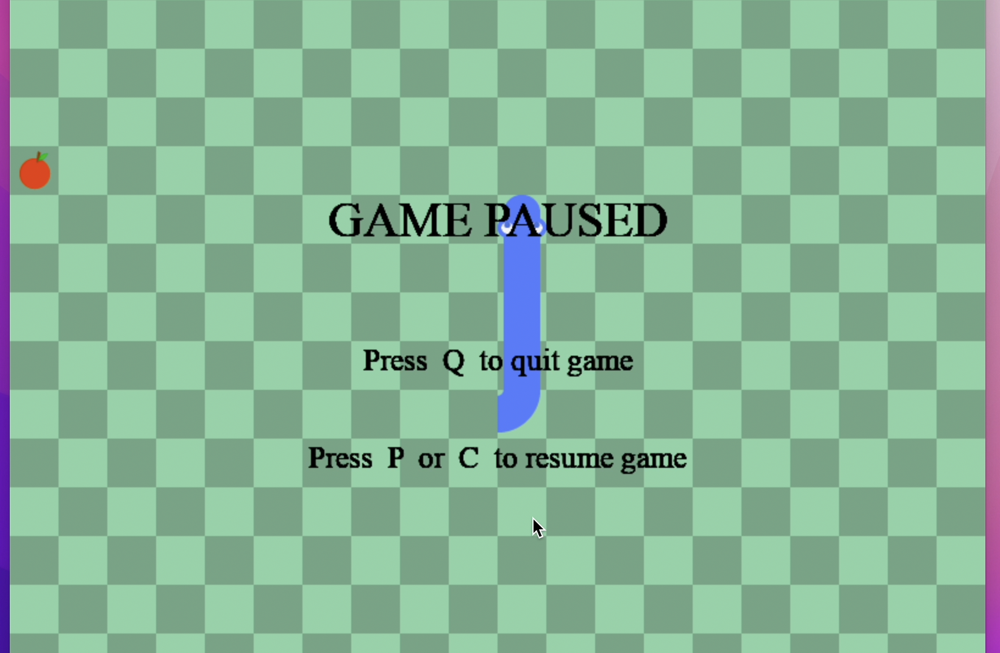
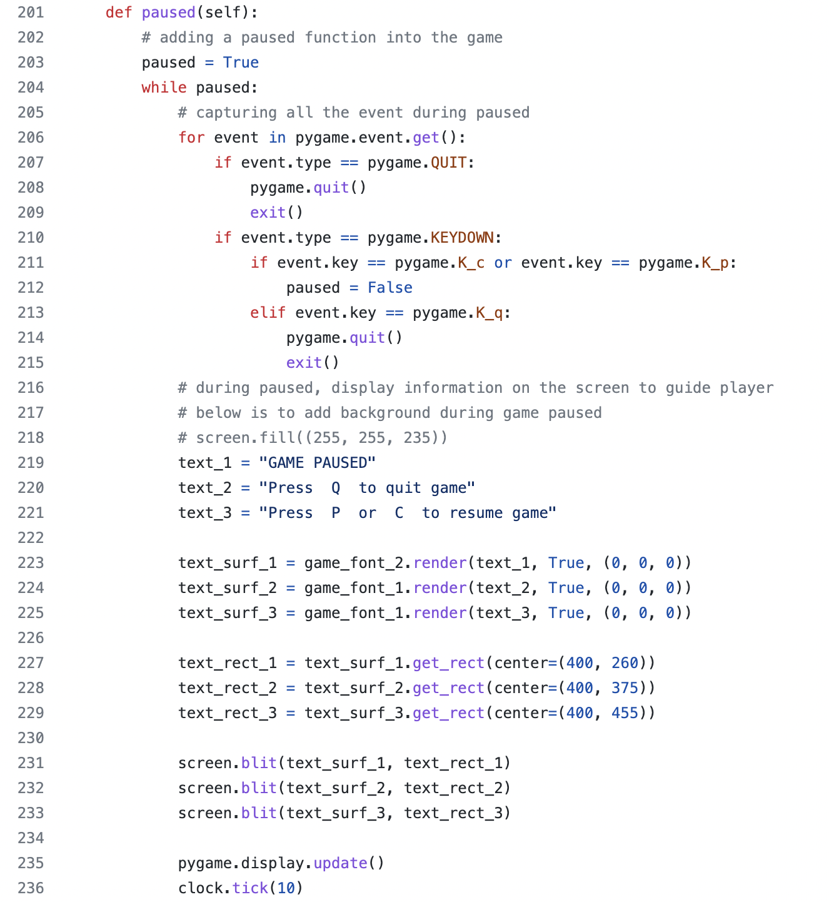
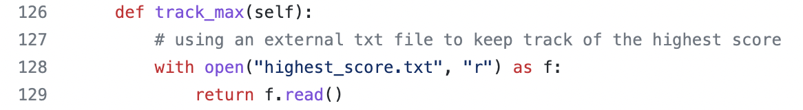
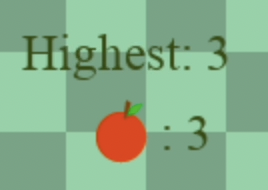
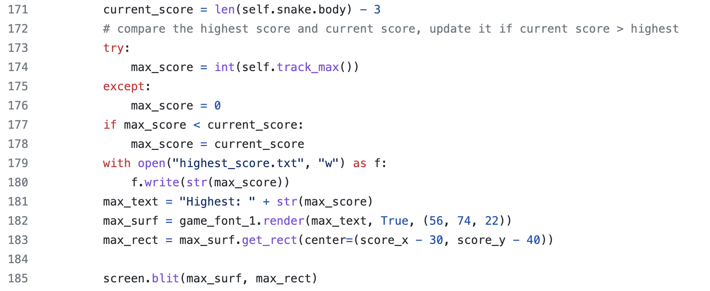

## CLICK HERE TO SEE DEMO: https://youtube.com/shorts/DWpSr7d1qMY?feature=share
    ** the background music was not recorded in the video. 

### This is my second personal project.
### The objective of this project is for me to learn pygame and improve my programing skill. 

**There are many snake game tutorials on Youtube and Github, however I could not find one that will give user a more completed gaming experience.**

To make the original game more enjoyable and compeleted, I build the following features/method:
   1. Added background music during the entire game
       ** can only be heard in game.
   2. A "PAUSED" feature to stop the game, and resume or quit if needed
   3. A method that keep track of the highest score in game (lower righthand corner)
   
   
        
   
   
   

### How to play
   ---- run " python snake_game.py " on cmd.
   1. use arrow keys to control the snake, once you press any arrow keys, snake will start moving.
   2. press P to pause the game.

### How to reset the highest score
   1. Go into highest_score.txt, delete everything, and then type "0" (zero) and save the file.
 
 
 

** 
One of the snake game tutorials inspried me and I recommend to try out:
https://www.youtube.com/watch?v=QFvqStqPCRU&ab_channel=ClearCode
